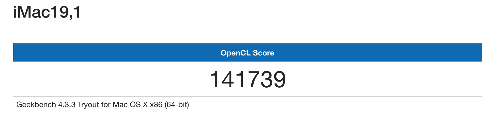
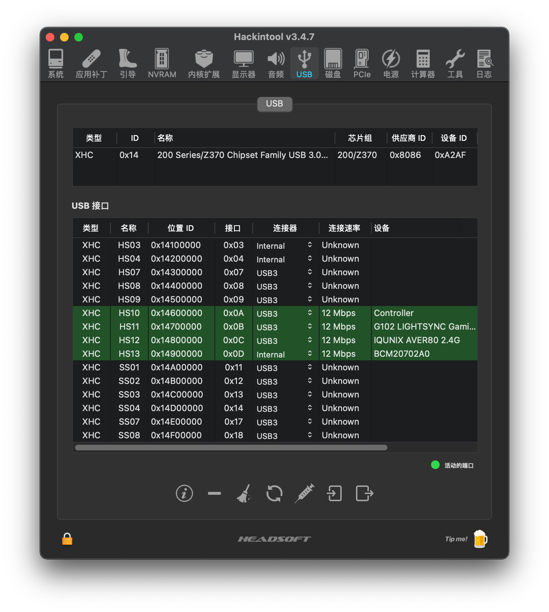

# ASRock-Z370m-ITX/ac

## 更新日志

### 2019-05-17

+ 初次提交 👨‍💻‍

## 🖥Snapshot / 快照

## 💻Hardware / 硬件

- macOS 10.14.5
- iMac19,2
- ASRock-Z370m-ITX/ac
- Intel Core i5-8400
- Sapphire RX 590 8G
- Corsair LPX DDR4 3200 8G*2
- Samsung SSD 960 EVO 250GB（Windows）
- Samsung SSD 860 EVO 250GB（macOS）
- Antec 500W EAG500 PRO Power
- Broadcom-BCM94352z—dw1560
- AOC 1080p monitor

## 📚Use / 使用

Download this rep EFI, and replace yours.

**Please to create a new serial number.**

下载这个仓库的EFI，并替换成你的EFI。

**请自己创建一个新的序列号**

## 🔖kext / kext

1. [DW1560(Bluetooth and wifi)](<https://blog.daliansky.net/Broadcom-BCM94352z-DW1560-drive-new-posture.html>)
   + AirportBrcmFixup.kext
   + BrcmFirmwareData.kext
   + BrcmPatchRAM2.kext
2. Audio
   + AppleALC.kext
   + Lilu.kext
3. CPU
   + CPUFriend.kext
   + Lilu.kext
4. USB
   + USBPorts.kext
5. GPU
   + WhateverGreen.kext    (RX590 need it)
6. Network port
   + SmallTree-Intel-211-AT-PCIe-GBE.kext

## 🔧what works / 工作

+ Audio
+ Bluetooth
+ wifi
+ Ethernet
+ Airdrop
+ USB
+ ...

## 🔧what doesn't work / 不工作

+ sleep

Wake up immediately after sleep。Guess is the USB port problem，but the port already Internal.

睡眠后立刻唤醒，如果不插键鼠USB没有问题，可是键鼠USB端口已经内建了。不知道原因是什么❓

## 🏃GeekBench / 跑分

## Blutbooth / 蓝牙

Blutbooth is ok! 👌

## 🖇CPU Frequency / CPU变频

10.14.5 the CPU Frequency have some problem，only show three gear position. But the temperature and  utilization is low. And the CPU Frequency at 0.8GHz. I think it's just display wrong.

在10.14.5中变频有问题，只显示三档。但是温度和CPU利用率都是很低，也是正常的。CPU频率最低在0.8GHz是正常的。可能是显示不对吧❌。

## 🔌USB / USB

use the Hackintool to make a USBPorts. No case usb ports

使用Hackintool创建一个了USBPorts。没有用机箱端口

## 🎥Video hard decoding / 视频硬解码

use the UHD630 and RX590 to hard decoding

使用核显和独显进行硬解码

可以看到4K使用独显硬解成功，CPU使用率极低。

## 🍎summary / 总结

我也只是个黑苹果的小白，这些东西都是看论坛和大佬的博客学到的。日常使用没有任何问题，睡眠问题对于我来说影响不大。以后有时间再看看，使黑苹果更完美。

[远景论坛](<http://bbs.pcbeta.com/forum-559-1.html>)

[黑果小兵](<https://blog.daliansky.net/>)

[tonymacx86](<https://www.tonymacx86.com/>)