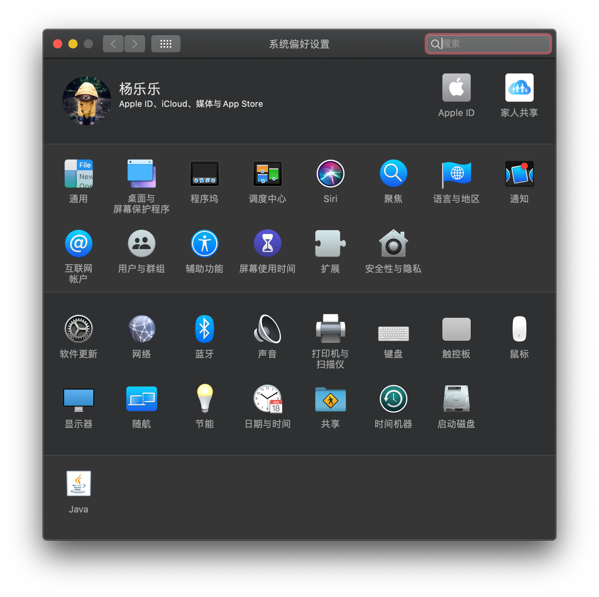

# ASRock-Z370m-ITX/ac

## 使用方式

1. 在`Releases`中下载`EFI`
2. 默认使用的是4K主题，需要1080p的可以将主题修改为`Minimalism`
3. 使用`Clover Configuration`随机一个新的序列号，以防和别人重复出现不必要的问题。

## 更新日志

[更新日志](https://github.com/youngle316/ASRock-Z370M-ITX-AC/blob/master/update.md)

## 关于本机

## 系统偏好设置

## 配置

| 名称      | 详情                           |
| --------- | ------------------------------ |
| 主板      | 华擎Z370m-ITX/ac               |
| 处理器    | 英特尔酷睿 i5-8400             |
| 内存      | 海盗船复仇者LPX DDR4 3000 8G*2 |
| 显卡      | 蓝宝石RX590                    |
| 硬盘1     | 三星960EVO 250G (windows)      |
| 硬盘2     | 三星860EVO 250G (macos)        |
| 硬盘3     | HHD 500G (存储与TimeMachine)   |
| 显示器    | LG 27ul500                     |
| WIFI+蓝牙 | BCM94352Z / DW1560             |

## 不工作

+ ~~睡眠会立即唤醒~~
  + ~~但是拔掉USB就可以正常睡眠。可能是定制的USB有问题吧。但是USB的速度是正常的。~~
  + ~~原因是 我的键盘是ikbc C104，这个键盘有问题。拔掉就可以正常睡眠，并且这个键盘mac识别不出型号。~~
  + 使用新的键盘tada68，蓝牙和有线连接都正常睡眠，唤醒也没有问题。
+ 没有设备，测试不了iMessage和FaceTime

总的来说，不完美，不过影响不大。

## 工作

除了不工作的，一切正常。

## 跑分

## 显示器

## 蓝牙

Blutbooth ok! 👌
[10.14驱动方式](https://blog.daliansky.net/Broadcom-BCM94352z-DW1560-drive-new-posture.html)

10.15 的驱动方式与上面的不同，新增了一个`BrcmBluetoothInjector.kext`

## 音频

id设为1

## CPU变频

## USB

~~使用Hackintool创建一个了USBPorts。没有用机箱端口。~~

7月23：重新定制了新的USB

[使用Hackintool定制自己的USB](https://younglele.cn/post/use-hackintool-custom-made-usb3.0/)

## 显卡

## 视频硬解码

使用核显和独显进行硬解码

可以看到4K使用独显硬解成功，CPU使用率极低。

## 🍎总结

我也只是个黑苹果的小白，这些东西都是看论坛和大佬的博客学到的。日常使用没有任何问题。以后有时间再看看，使黑苹果更完美。

[远景论坛](<http://bbs.pcbeta.com/forum-559-1.html>)

[黑果小兵](<https://blog.daliansky.net/>)

[tonymacx86](<https://www.tonymacx86.com/>)
