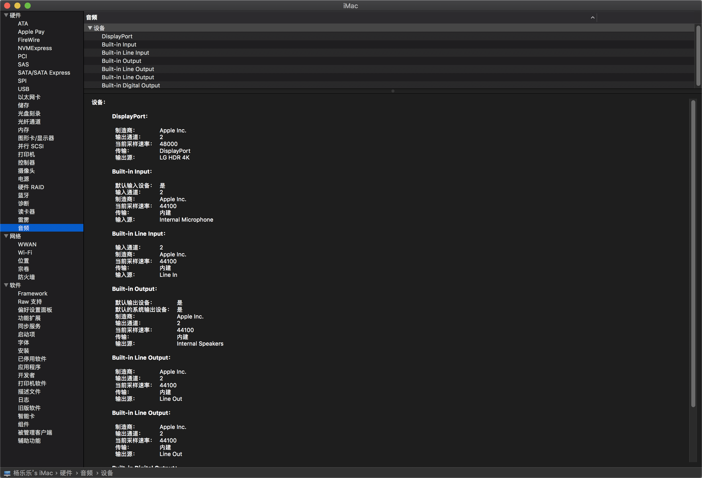
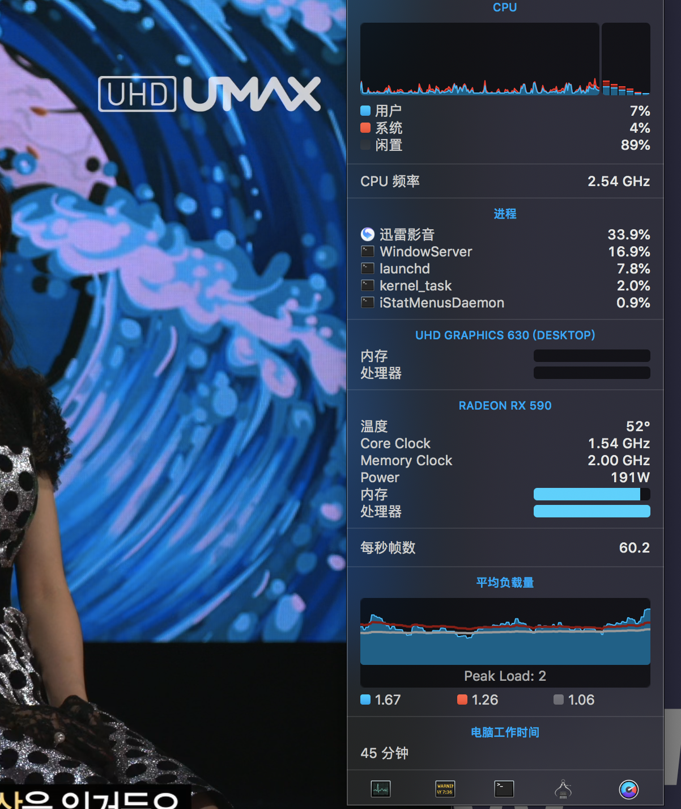

# ASRock-Z370m-ITX/ac

## 更新日志

### 2019-06-29

> 4K是真的爽🤙

+ Update `Clover` 4972
+ Change  `VirtualSMC` to `FakeSMC`
+ Delete `AptioMemoryFix-64.efi`
+ 修改了4K的Clover主题
+ Clover倒数时间修改为1S

### 2019-06-16

+ Update `Clover` 4961
+ Update `Lilu` v1.3.6
+ Update `WhateeverGreen` v1.2.9
+ Update `AppleALC` v1.3.8
+ Update `CPUFriengd` v1.1.7
+ Change `FakeSMC` to `VirtualSMC`
+ Add `SMCProcessor.kext`
+ Add `SMCSuperIO.kext`

### 2019-05-17

+ 初次提交 

## 关于本机

## 配置

| 名称      | 详情                           |
| --------- | ------------------------------ |
| 主板      | 华擎Z370m-ITX/ac               |
| 处理器    | 英特尔酷睿 i5-8400             |
| 内存条    | 海盗船复仇者LPX DDR4 3000 8G*2 |
| 显卡      | 蓝宝石RX590                    |
| 硬盘1     | 三星960EVO 250G (windows)      |
| 硬盘2     | 三星860EVO 250G (macos)        |
| 硬盘3     | HHD 500G (存储与TimeMachine)   |
| 显示器    | LG 27ul500                     |
| WIFI+蓝牙 | BCM94352Z / DW1560             |

## 不工作

+ 睡眠会立即唤醒
  + 但是拔掉USB就可以正常睡眠。可能是定制的USB有问题吧。但是USB的速度是正常的。
+ iMessage和FaceTime不可用

总的来说，不完美，不过影响不大。

## 工作

除了不工作的，一切正常。

## 跑分

## 显示器

## 蓝牙

Blutbooth is ok! 👌

## 音频

id设为1

## CPU变频

在10.14.5中变频有问题，只显示三档。但是温度和CPU利用率都是很低，也是正常的。CPU频率最低在0.8GHz是正常的。可能是显示不对吧❌。

## USB

使用Hackintool创建一个了USBPorts。没有用机箱端口。

## 视频硬解码

使用核显和独显进行硬解码

可以看到4K使用独显硬解成功，CPU使用率极低。

## 🍎总结

我也只是个黑苹果的小白，这些东西都是看论坛和大佬的博客学到的。日常使用没有任何问题，睡眠问题对于我来说影响不大。以后有时间再看看，使黑苹果更完美。

[远景论坛](<http://bbs.pcbeta.com/forum-559-1.html>)

[黑果小兵](<https://blog.daliansky.net/>)

[tonymacx86](<https://www.tonymacx86.com/>)
